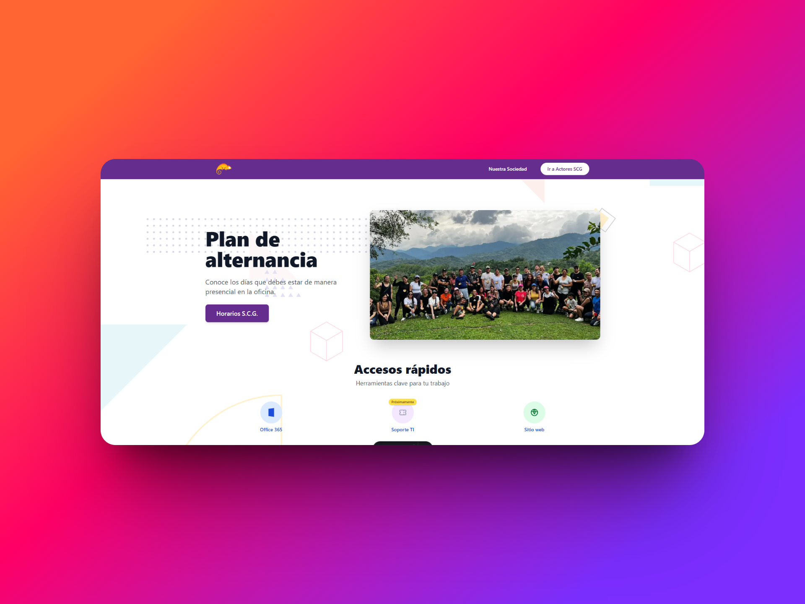

# 🌐 Intranet Actores SCG



Este es el repositorio del sitio web de la **Intranet de Actores Sociedad Colombiana de Gestión**, desarrollado con **Astro**. Aquí se centralizan accesos, herramientas y recursos de uso interno para el equipo de trabajo.

## 🚀 Tecnologías utilizadas

- **Astro** – Framework moderno orientado a performance.
- **Tailwind CSS** – Utilidades para estilos rápidos y responsivos.
- **TypeScript** – Mejora de mantenibilidad del código.
- **Markdown** – Para secciones estáticas cuando es necesario.
- **Vercel** o servidor interno – Despliegue según el entorno.

## 📁 Estructura del proyecto

```bash
├── public/               # Recursos públicos como imágenes y favicon
├── src/
│   ├── components/       # Componentes reutilizables (Navbar, Cards, etc.)
│   ├── layouts/          # Estructuras base de páginas
│   ├── pages/            # Páginas principales del sitio (ruta = archivo)
│   ├── styles/           # Estilos personalizados
│   └── utils/            # Funciones auxiliares
├── astro.config.mjs      # Configuración de Astro
├── tailwind.config.cjs   # Configuración de Tailwind
├── tsconfig.json         # Configuración TypeScript
└── package.json          # Dependencias y scripts del proyecto